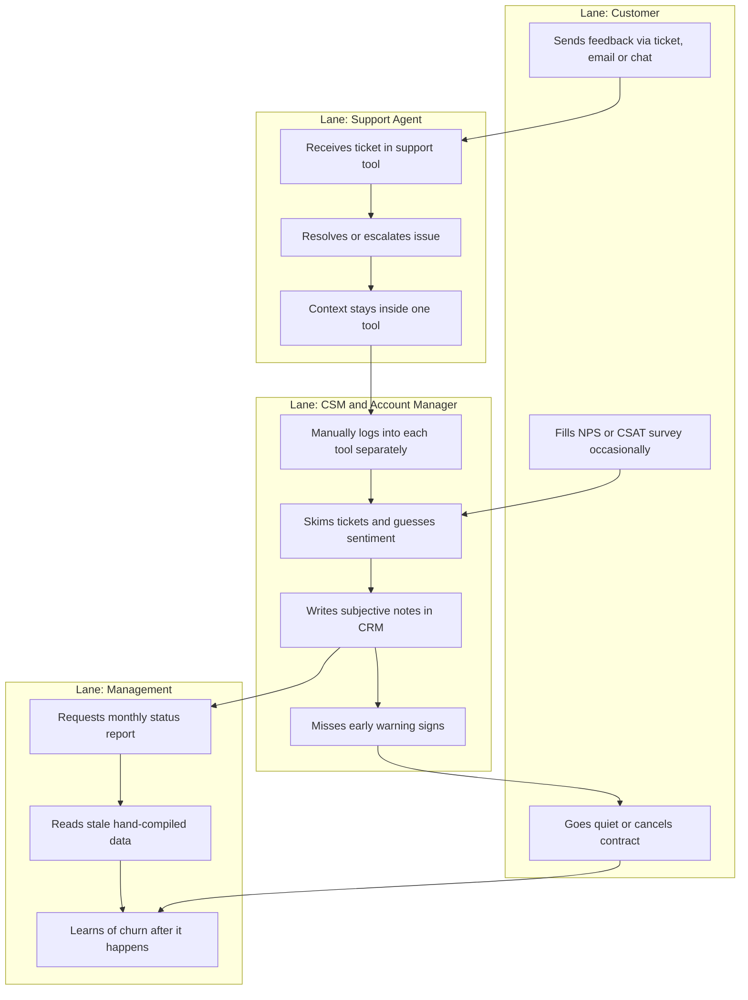
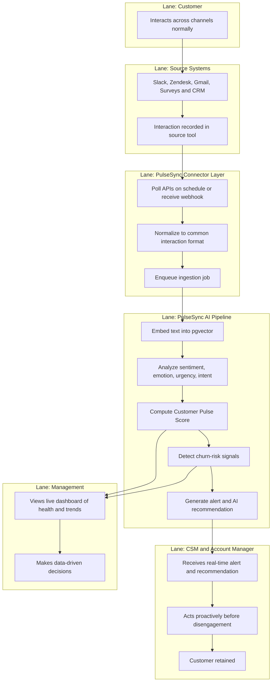

# PulseSync — Swimlane Diagram (AS-IS & TO-BE)

> **Project:** PulseSync – AI-Powered Customer Pulse Platform
> **Generated:** 2026-05-20
> **Purpose:** Compare the current manual customer-sentiment process (AS-IS)
> against the PulseSync-enabled process (TO-BE).

---

## 1. AS-IS Process — How Customer Sentiment Is Handled Today

Customer feedback is scattered across tools. There is no unified view. Churn is
discovered **after** the customer has already disengaged.

### 1.1 AS-IS Narrative

1. A customer raises issues or feedback across disconnected channels (support
   tickets, email, chat, survey responses, call notes).
2. A **Support Agent** handles each ticket in isolation — resolves it or
   escalates it. Context lives only inside that one tool.
3. A **CSM / Account Manager** occasionally logs into each tool manually,
   skims recent tickets, and jots subjective notes into the CRM.
4. **Management** receives a manually compiled report, usually monthly, that is
   already stale by the time it is read.
5. Churn is identified **reactively** — often only when the customer cancels or
   stops responding.

### 1.2 AS-IS Swimlane

### 1.3 AS-IS Pain Points

| # | Pain Point | Impact |
|---|-----------|--------|
| 1 | Feedback scattered across 6+ tools | No single source of truth |
| 2 | Sentiment judged manually & subjectively | Inconsistent, biased reads |
| 3 | No continuous monitoring | Problems noticed weeks late |
| 4 | Reports compiled by hand | Slow, stale, error-prone |
| 5 | Churn detected reactively | No time to intervene |
| 6 | Does not scale with customer count | CSM time is the bottleneck |

---

## 2. TO-BE Process — With PulseSync

PulseSync continuously ingests interactions from every channel, runs AI sentiment
analysis, computes a unified **Customer Pulse Score**, detects churn risk, and
pushes **proactive alerts and recommendations** to the CSM in real time.

### 2.1 TO-BE Narrative

1. The customer interacts normally across channels — no behavior change needed.
2. **Source systems** (Slack, Zendesk, Gmail/Outlook, Zoom/Meet, Surveys, CRM)
   record those interactions.
3. The **PulseSync Connector Layer** polls each source on a schedule (or receives
   webhooks) and normalizes everything into a common interaction format.
4. The **AI Pipeline** embeds, analyzes sentiment/emotion/urgency, computes the
   Pulse Score, and runs churn-risk detection.
5. When a score drops or risk crosses a threshold, an **Alert** is generated
   with an AI-written recommendation for the next action.
6. The **CSM** receives the alert immediately and acts before the customer
   disengages.
7. **Management** sees live customer health on a dashboard — no manual reports.

### 2.2 TO-BE Swimlane

### 2.3 TO-BE Improvements

| AS-IS Problem | TO-BE Solution | Outcome |
|---------------|----------------|---------|
| Scattered feedback | Unified Connector Layer | One source of truth |
| Subjective sentiment | AI sentiment analysis | Consistent, scored |
| No monitoring | Continuous ingestion pipeline | Always current |
| Manual reports | Live dashboard | Zero compilation effort |
| Reactive churn | Churn-risk detection + alerts | Proactive intervention |
| Does not scale | Automated per-customer scoring | Scales to all accounts |

---

## 3. AS-IS vs TO-BE Summary

| Dimension | AS-IS | TO-BE |
|-----------|-------|-------|
| Data location | 6+ disconnected tools | Centralized PulseSync DB |
| Sentiment method | Manual, subjective | AI-scored, consistent |
| Monitoring cadence | Occasional, manual | Continuous, automated |
| Churn detection | After the fact | Proactive, predictive signals |
| Alerting | None | Real-time (<5 min target) |
| Reporting | Monthly, hand-built | Live dashboard |
| Scalability | Limited by CSM hours | Scales with automation |
| Recommendations | Tribal knowledge | AI-generated next actions |
