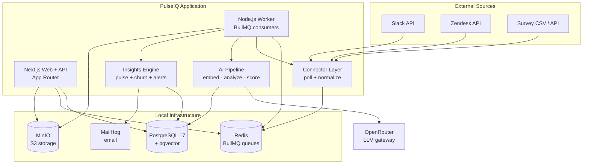
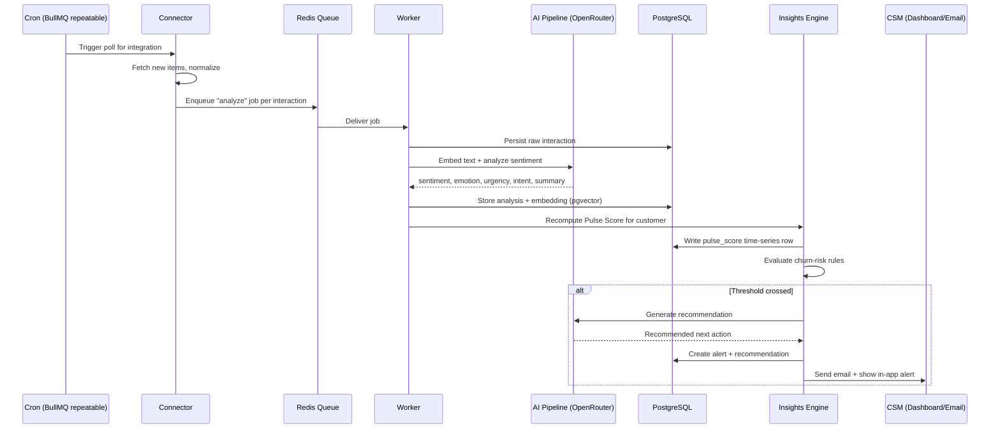
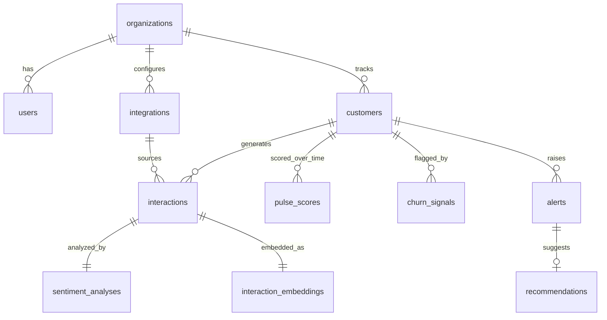

# PulseIQ — Application Design

> **Product:** PulseIQ – AI-Powered Customer Pulse Platform
> **Version:** 1.0 (MVP)
> **Generated:** 2026-05-20
> **Companion docs:** `01-swimlane-diagram.md`, `02-PRD.md`

---

## 1. Architecture Overview

PulseIQ is a single Next.js full-stack application plus a background worker,
backed by PostgreSQL (with pgvector), Redis, and MinIO. All services run
locally via Docker Compose. LLM calls route through **OpenRouter**.

### 1.1 Component Diagram



### 1.2 Major Subsystems

| Subsystem | Responsibility |
|-----------|----------------|
| Web + API | Auth, dashboard UI, REST API, integration config |
| Connector Layer | Poll source APIs, normalize to common interaction shape |
| Ingestion Queue | BullMQ queues for ingest, analyze, score, alert jobs |
| Worker | Consumes queue jobs, orchestrates the pipeline |
| AI Pipeline | Embeddings + sentiment/emotion/urgency/intent + summary |
| Insights Engine | Pulse scoring, churn-risk rules, alert generation |
| Storage | PostgreSQL (data + vectors), MinIO (files), Redis (queues) |

---

## 2. Data Flow — Ingestion to Alert



---

## 3. Data Model

PostgreSQL with the `vector` extension enabled. All tenant-scoped tables carry
`organization_id`. Managed with Drizzle ORM migrations.



### 3.1 Table Summary

| Table | Key Columns | Purpose |
|-------|-------------|---------|
| `organizations` | id, name, created_at | Tenant root |
| `users` | id, org_id, email, role, password_hash | Auth + RBAC (admin/csm/viewer) |
| `customers` | id, org_id, name, external_ref, segment | Tracked customer accounts |
| `integrations` | id, org_id, type, config_json, credentials_enc, status, last_synced_at | Connector config (creds encrypted) |
| `interactions` | id, org_id, customer_id, integration_id, channel, content, author, occurred_at | Raw normalized interactions |
| `interaction_embeddings` | interaction_id, embedding vector(1536) | Vector for similarity search |
| `sentiment_analyses` | interaction_id, sentiment_score, label, emotions[], urgency, intent, summary, highlights[] | AI output per interaction |
| `pulse_scores` | id, org_id, customer_id, score, components_json, computed_at | Time-series health score |
| `churn_signals` | id, org_id, customer_id, signal_type, severity, detail, detected_at | Active churn-risk signals |
| `alerts` | id, org_id, customer_id, type, severity, message, status, created_at | Generated alerts |
| `recommendations` | id, alert_id, action_text, generated_at | AI next-action suggestion |

### 3.2 Pulse Score Formula (MVP)

`pulse = clamp(0, 100, round( w1*sentiment + w2*resolution + w3*escalation + w4*engagement ))`

| Component | Source | Default Weight |
|-----------|--------|----------------|
| sentiment | Avg recent sentiment, normalized 0–100 | 0.40 |
| resolution | % issues resolved (unresolved penalizes) | 0.25 |
| escalation | Inverse of escalation frequency | 0.15 |
| engagement | Interaction recency + volume vs baseline | 0.20 |

Weights live in config so they can be tuned without code changes.

---

## 4. API Surface

REST endpoints implemented as Next.js Route Handlers under `src/app/api/`.
All routes require an authenticated session and are tenant-scoped.

| Method & Path | Purpose |
|---------------|---------|
| `POST /api/auth/[...nextauth]` | Auth.js sign-in/out |
| `GET/POST /api/integrations` | List / create integrations |
| `PATCH/DELETE /api/integrations/:id` | Update / remove integration |
| `POST /api/integrations/:id/sync` | Trigger an immediate poll |
| `GET /api/customers` | List customers with current Pulse Score |
| `GET /api/customers/:id` | Customer detail (trend, issues, interactions) |
| `GET /api/interactions` | Paginated interactions (filterable) |
| `GET /api/pulse/:customerId` | Pulse Score time series |
| `GET /api/alerts` | Active alerts feed |
| `PATCH /api/alerts/:id` | Acknowledge / resolve an alert |
| `POST /api/surveys/import` | Upload survey CSV |
| `POST /api/webhooks/:provider` | Optional webhook ingestion |

---

## 5. AI Pipeline Design

All LLM calls use the **Vercel AI SDK** with the **OpenRouter** provider
(`@openrouter/ai-sdk-provider`). Model IDs are configurable via env.

| Stage | Function | Model (default, configurable) |
|-------|----------|-------------------------------|
| Embed | `generateEmbedding()` — text → vector | `openai/text-embedding-3-small` |
| Analyze | `analyzeSentiment()` — structured output | `anthropic/claude-3.5-haiku` |
| Summarize | `summarizeInteraction()` | `anthropic/claude-3.5-haiku` |
| Recommend | `generateRecommendation()` | `anthropic/claude-3.5-sonnet` |

- Sentiment analysis uses **structured output** (`generateObject`) with a Zod
  schema → `{ sentimentScore, label, emotions, urgency, intent, highlights }`.
- All AI jobs are **idempotent** (keyed by interaction id) and retried by
  BullMQ with exponential backoff.
- A single `aiClient` module centralizes OpenRouter config, so swapping models
  or providers is a one-file change.

---

## 6. Background Jobs (BullMQ Queues)

| Queue | Trigger | Job |
|-------|---------|-----|
| `connector-poll` | Repeatable cron per integration | Fetch + normalize new interactions |
| `analyze` | Per new interaction | Embed + sentiment analysis + summary |
| `score` | After analyze | Recompute Pulse Score |
| `churn-eval` | After score | Evaluate churn-risk rules |
| `alert` | When threshold crossed | Generate recommendation + dispatch alert |

The worker is a separate process entrypoint (`src/worker/index.ts`) sharing the
same codebase, so DB schema and connector logic are reused.

---

## 7. Project Structure

```
pulseiq/
├── docker-compose.yml              # postgres, redis, minio, mailhog, web, worker
├── docker-compose.observability.yml# optional: grafana, loki, prometheus
├── .env.example
├── drizzle.config.ts
├── package.json
├── drizzle/                        # generated SQL migrations
└── src/
    ├── app/
    │   ├── (dashboard)/            # portfolio, customer detail, alerts pages
    │   ├── api/                    # route handlers (see §4)
    │   └── auth/                   # sign-in / sign-up
    ├── components/                 # shadcn/ui-based components, charts
    ├── lib/
    │   ├── db/                     # drizzle client + schema
    │   ├── ai/                     # OpenRouter client + analyze/summarize/recommend
    │   ├── connectors/             # slack, zendesk, surveys (+ stubs)
    │   │   ├── base.ts             # Connector interface
    │   │   ├── slack.ts
    │   │   ├── zendesk.ts
    │   │   └── surveys.ts
    │   ├── queue/                  # BullMQ queue + worker setup
    │   ├── pulse/                  # scoring engine
    │   ├── churn/                  # churn-risk rule engine
    │   ├── alerts/                 # alert dispatch (in-app + email)
    │   └── auth/                   # Auth.js config
    └── worker/
        ├── index.ts                # worker entrypoint
        └── jobs/                   # one file per queue consumer
```

---

## 8. Connector Interface

Every integration implements a common interface so new sources slot in without
touching the pipeline. Polling is the MVP default; webhooks are optional.

```ts
interface Connector {
  type: 'slack' | 'zendesk' | 'surveys' | 'gmail' | 'zoom' | 'crm';
  // Pull new items since the last sync cursor.
  poll(integration: Integration, since: Date): Promise<RawInteraction[]>;
  // Normalize a raw item into the canonical interaction shape.
  normalize(raw: RawInteraction): NormalizedInteraction;
  // Optional webhook handler.
  handleWebhook?(payload: unknown): Promise<NormalizedInteraction[]>;
}
```

`NormalizedInteraction` is the single shape the AI pipeline consumes —
`{ customerRef, channel, content, author, occurredAt, metadata }`.

---

## 9. Security & Multi-Tenancy

- **Tenant isolation:** every tenant-scoped query filters by `organization_id`;
  a Drizzle helper enforces it so it cannot be forgotten.
- **Credential encryption:** integration secrets stored in `credentials_enc`,
  encrypted with AES-256-GCM using a key from the environment.
- **RBAC:** roles `admin` (configure integrations), `csm` (act on alerts),
  `viewer` (read-only dashboard).
- **Auth:** Auth.js sessions, password hashing with bcrypt/argon2.
- **Secrets:** all keys (OpenRouter, encryption key, DB) via `.env`, never
  committed; `.env.example` documents required vars.

---

## 10. Local Environment

`docker compose up` brings up the full stack:

| Service | Port | Notes |
|---------|------|-------|
| web (Next.js) | 3000 | Dashboard + API |
| worker | — | Background job consumer |
| postgres | 5432 | `pgvector/pgvector:pg17` image |
| redis | 6379 | BullMQ backend |
| minio | 9000 / 9001 | S3 API + console |
| mailhog | 8025 | Email inbox UI |

Required env vars: `DATABASE_URL`, `REDIS_URL`, `OPENROUTER_API_KEY`,
`AUTH_SECRET`, `ENCRYPTION_KEY`, `MINIO_*`, plus per-integration credentials
entered through the UI.

---

## 11. Key Design Decisions

| Decision | Rationale |
|----------|-----------|
| Polling over webhooks for MVP | Works on localhost without a tunnel |
| Redis + BullMQ over Kafka | Right-sized for 1–10 tenants; far less ops |
| Next.js routes over FastAPI | One language, one repo, faster solo build |
| Docker Compose over Kubernetes | Reproducible local stack, no cluster overhead |
| MinIO over AWS S3 | Local, S3-compatible — swap later with no code change |
| OpenRouter via AI SDK | One key, any model; provider swap is one config line |
| pgvector in main DB | No separate vector DB to operate |
