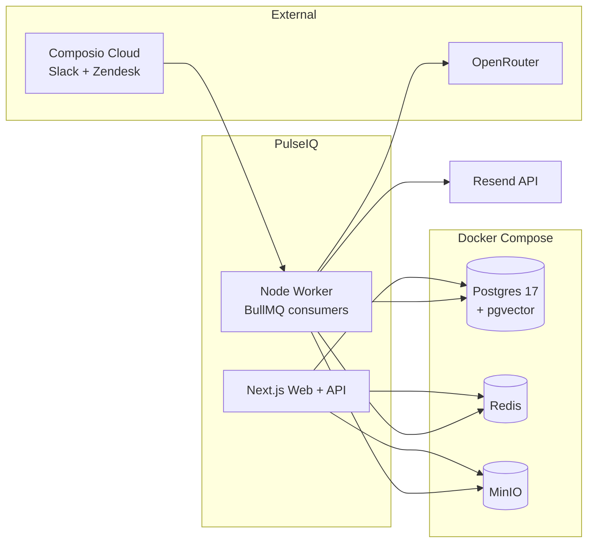

# PulseIQ — Implementation Plan (Phases + Waves)

> **Generated:** 2026-05-23
> **Status:** Draft (awaiting approval)
> **Format:** Phases + waves only — feature-level breakdown is intentionally
> left for per-phase planning at execution time.
> **Companion docs:** `../01-swimlane-diagram.md`, `../02-PRD.md`, `../03-application-design.md`

---

## 1. Project Overview

**Goal:** Build the PulseIQ MVP — an AI-powered customer pulse platform that
ingests interactions from Slack, Zendesk, and Surveys (CSV), runs LLM
sentiment/emotion/urgency analysis, computes a unified Pulse Score per
customer, detects churn risk via rule engine, and pushes alerts with
AI-generated recommendations to CSMs.

**Target users:** CSM/Account Manager, Support Lead, Management, Admin.

**Scope:** Everything in PRD §7 "In scope". Nothing cut.

**Success criteria (from PRD §8):**

- Sentiment classification ≥ 85% agreement vs human spot-check
- Interaction → alert latency < 5 min
- Dashboard initial load < 2 sec on pilot data
- `docker compose up` brings the full stack online
- Pilot-ready for 1–10 tenant organizations

---

## 2. Market & OSS Research (summary)

Searched the OSS landscape; no fork-and-rebrand candidate exists. Closest
neighbours and how they relate:

| Project | Relation to PulseIQ |
|---|---|
| **Chatwoot** (MIT, ~29k★) | Best omnichannel inbox OSS. Different stack (Rails). Patterns worth referencing for Slack/Zendesk integration shape; not a code donor. |
| **Erxes** (AGPL) | "Experience OS" with plugin model. Heavyweight; analytics layer is weak. |
| **Tiledesk** | LLM agent + HITL chatbots. Different problem (conversation orchestration, not analytics). |
| **Airbyte / Meltano** | Connector frameworks. Superseded for MVP by Composio Cloud. Reconsider for P1/P2 connectors. |
| **awesome-customer-success** | Confirms there is no flagship OSS CS platform — the differentiated analytics layer (Pulse Score + churn + AI recs) is genuinely greenfield. |

**Takeaways folded into this plan:**

- Build greenfield on the approved Next.js stack — no OSS base.
- Use Composio Cloud for Slack/Zendesk connectors → eliminates per-provider OAuth/API plumbing.
- Keep the Vercel AI SDK (PRD spec) over LangChain — four stateless structured-output calls don't justify LangChain's abstractions.

---

## 3. Tech Stack

| Layer | Technology | Source |
|---|---|---|
| Frontend + API | Next.js 16 (App Router) + Tailwind + shadcn/ui | PRD §6 |
| Worker | Node.js (same repo, separate entrypoint) | PRD §6 |
| Database | PostgreSQL 17 + pgvector | PRD §6 |
| ORM | Drizzle | PRD §6 |
| Queue | Redis + BullMQ | PRD §6 |
| AI | Vercel AI SDK + OpenRouter | confirmed this session |
| Connectors | **Composio Cloud** (Slack, Zendesk) + native CSV (Surveys) | confirmed this session |
| Auth | Auth.js v5 + Postgres adapter | PRD §6 |
| Object storage | MinIO (S3-compatible) | PRD §6 |
| Email | **Resend** (dev + prod via API key, env-configurable from/domain) | confirmed this session |
| Observability | Pino logs + optional Grafana/Loki/Prometheus | PRD §6 |
| Orchestration | Docker Compose | PRD §6 |

**Note on NFR-1:** Composio Cloud and OpenRouter are both external services.
Strict "no cloud accounts" is relaxed for the MVP — the *stack* still boots
locally with `docker compose up`; the LLM gateway and connector hub require
API keys.

---

## 4. Architecture Overview

Single full-stack Next.js app + Node worker, behind a docker-compose stack.

See `03-application-design.md` for the full component diagram, sequence
diagram, and data model.

---

## 5. Phase Dependency Graph

| # | Phase | Dependency | Can parallelize with |
|---|---|---|---|
| 1 | **Foundation** — repo, compose stack, shadcn, Drizzle init, BullMQ skeleton, base layout | `INDEPENDENT` | — |
| 2 | **Database schema** — all 11 tables (PRD §3.1), pgvector enable, migrations, tenant helper, seed | `DEPENDENT(1)` | 4, 14 |
| 3 | **Auth + RBAC** — Auth.js v5, sign-in/up pages, session, role guards, org context | `DEPENDENT(2)` | 5, 6, 7, 8, 9, 11, 12 |
| 4 | **AI client module** — OpenRouter via AI SDK; `embed`, `analyze` (Zod), `summarize`, `recommend` | `DEPENDENT(1)` | 2, 14 |
| 5 | **Composio connector layer** — Composio SDK, Slack + Zendesk connectors, Surveys CSV importer, normalization, cursor management | `DEPENDENT(2)` | 3, 6, 7, 8, 9, 11, 12 |
| 6 | **Pulse Score engine** — formula (PRD §3.2), 4 components, time-series writer, configurable weights | `DEPENDENT(2)` | 3, 5, 7, 8, 9, 11, 12 |
| 7 | **Churn rule engine** — sustained negative, repeated complaints, declining engagement, unresolved high-urgency; severity output | `DEPENDENT(2)` | 3, 5, 6, 8, 9, 11, 12 |
| 8 | **Alerts + recommendations + email** — threshold rules, AI rec via Phase 4, in-app store, Resend dispatch + React Email templates | `DEPENDENT(2, 4)` | 3, 5, 6, 7, 9, 11, 12 |
| 9 | **API surface** — all Route Handlers from PRD §4, tenant-scoping middleware, Zod input validation | `DEPENDENT(2, 3)` | 5, 6, 7, 8, 11, 12 |
| 10 | **Worker + queue wiring** — 5 BullMQ queues (connector-poll, analyze, score, churn-eval, alert), repeatable cron, idempotency keys, retry/backoff | `DEPENDENT(4, 5, 6, 7, 8)` | 11, 12, 13 |
| 11 | **Dashboard UI** — portfolio, customer detail (trend chart, top issues, interactions), alerts feed, AI summary view | soft-`DEPENDENT(9)` (starts on mocks after 1) | 5, 6, 7, 8, 12 |
| 12 | **Integration config UI** — list/add/remove integrations, Composio OAuth trigger, manual sync, status display | soft-`DEPENDENT(9)` (starts on mocks after 1) | 5, 6, 7, 8, 11 |
| 13 | **Survey CSV import (UI + parser)** — upload form, CSV parse, customer mapping preview | `DEPENDENT(5, 9)` | 10, 11, 12 |
| 14 | **Observability** — Pino logger setup, optional Grafana/Loki/Prometheus compose, worker job metrics | `DEPENDENT(1)` | 2, 4 |
| 15 | **Polish + hardening** — AES-256-GCM for `credentials_enc`, tenant isolation audit, demo data + script, e2e demo flow test, README | `DEPENDENT(all)` | — |

---

## 6. Parallel Execution Schedule (5–8 Agents)

Each wave completes before the next starts. Within a wave, all assignments
are independent and may run concurrently. Wave 3 hits the full 8-agent
throughput.

| Wave | A1 | A2 | A3 | A4 | A5 | A6 | A7 | A8 |
|---|---|---|---|---|---|---|---|---|
| **W1** | Phase 1 | — | — | — | — | — | — | — |
| **W2** | Phase 2 | Phase 4 | Phase 14 | — | — | — | — | — |
| **W3** | Phase 3 | Phase 5 | Phase 6 | Phase 7 | Phase 8 | Phase 9 | Phase 11 (mock API) | Phase 12 (mock API) |
| **W4** | Phase 10 | Phase 13 | UI → real-API wiring | — | — | — | — | — |
| **W5** | Phase 15 | — | — | — | — | — | — | — |

### File-ownership map (no overlap within a wave)

| Assignment | Owned paths |
|---|---|
| Phase 1 | `docker-compose.yml`, `package.json`, `drizzle.config.ts`, `src/app/layout.tsx`, `src/components/ui/*`, `.env.example`, root configs |
| Phase 2 | `src/lib/db/schema/*`, `drizzle/migrations/*`, `src/lib/db/tenant.ts`, `scripts/seed.ts` |
| Phase 3 | `src/lib/auth/*`, `src/app/(auth)/*`, `src/middleware.ts` |
| Phase 4 | `src/lib/ai/*` (client, embed, analyze, summarize, recommend) |
| Phase 5 | `src/lib/connectors/*` (composio, base, slack, zendesk, surveys, normalize) |
| Phase 6 | `src/lib/pulse/*` |
| Phase 7 | `src/lib/churn/*` |
| Phase 8 | `src/lib/alerts/*`, `src/lib/email/*` |
| Phase 9 | `src/app/api/**` (route handlers only) |
| Phase 10 | `src/worker/*`, `src/lib/queue/*` |
| Phase 11 | `src/app/(dashboard)/*`, `src/components/charts/*`, `src/components/customer/*` |
| Phase 12 | `src/app/(settings)/integrations/*`, `src/components/integrations/*` |
| Phase 13 | `src/app/(settings)/surveys/*`, `src/lib/surveys/*` |
| Phase 14 | `docker-compose.observability.yml`, `src/lib/logger.ts`, `src/lib/metrics.ts` |
| Phase 15 | cross-cutting (encryption helper, demo script, e2e tests, README) |

---

## 7. Mock-API Contract (unblocks Wave 3 UI work)

To let Phases 11 and 12 start in Wave 3 before Phase 9 finishes, the API
surface is contract-first: Phase 9 publishes Zod schemas + TS types into
`src/lib/api/contracts/*` early (before route handlers). Phases 11/12 import
those types and consume an MSW-mocked client until Wave 4 wiring.

This makes the 8-agent Wave 3 schedule realistic.

---

## 8. Per-Phase Effort (T-shirt, solo-equivalent)

| Phase | Effort |
|---|---|
| 1 Foundation | M |
| 2 DB schema | M |
| 3 Auth + RBAC | M |
| 4 AI client | S |
| 5 Composio connectors | L |
| 6 Pulse Score | M |
| 7 Churn rules | S |
| 8 Alerts + email | M |
| 9 API surface | L |
| 10 Worker + queues | M |
| 11 Dashboard UI | L |
| 12 Integration UI | M |
| 13 Survey CSV import | S |
| 14 Observability | S |
| 15 Polish + hardening | M |

Solo-sequential: ~3 weeks. With Wave 3 parallelism across 8 agents:
**~7–10 working days end-to-end** if dependencies hold and integration in
Wave 4 stays clean. Matches PRD §4 target (2–4 weeks).

---

## 9. Risk Register

| # | Risk | Impact | Likelihood | Mitigation |
|---|---|---|---|---|
| R1 | Composio Cloud API behaviour for Slack/Zendesk diverges from docs | M | M | Spike Phase 5.1 first in Wave 2 alongside Phase 2 if capacity allows; keep `Connector` interface so we can swap to native SDK |
| R2 | pgvector + Drizzle migration friction with HNSW indexes | M | L | Phase 2 includes a dedicated migration test on the docker-compose pg image |
| R3 | OpenRouter rate limits during batch backfill | M | M | Phase 4 enforces concurrency cap; Phase 10 jobs use BullMQ rate limiter |
| R4 | Pulse Score weights produce noisy alerts on small data sets | M | H | Phase 6 weights are env-configurable; Phase 15 demo data tunes them |
| R5 | Wave-3 UI work blocked because API contracts arrive late | H | M | Phase 9 owner publishes Zod contracts in the first hour of Wave 3 — gate Phases 11/12 on that artifact |
| R6 | Multi-tenant leak (forgotten `organization_id` filter) | H | M | Phase 2 ships `tenantScoped()` helper; Phase 15 audit grep for raw `db.select` without the helper |
| R7 | Credential encryption key management for `credentials_enc` | H | L | Phase 15 wires AES-256-GCM with key from env; document key rotation in README |

---

## 10. Out of Scope (explicit, MVP)

Carried directly from PRD §3 Non-Goals and §7 — restated so agents don't drift:

- Voice/audio sentiment
- ML-based churn forecasting (rule engine only)
- Autonomous remediation workflows
- Production multi-region / HA
- SSO, audit logs, multi-tenant hardening beyond pilot
- Gmail/Outlook (P1), Zoom/Meet (P2), Salesforce/HubSpot (P2) connectors — interface stubs only, no implementation
- Webhook ingestion (polling only for MVP; webhook route stub exists)

---

## 11. Glossary

| Term | Definition |
|---|---|
| Pulse Score | 0–100 unified customer health score, recomputed per new interaction + daily (PRD §5.3) |
| Churn signal | Output of the rule engine; one of: sustained-negative, repeated-complaint, declining-engagement, unresolved-high-urgency |
| Interaction | Normalized record from any source: `{ customerRef, channel, content, author, occurredAt, metadata }` |
| Connector | Implementation of the `Connector` interface — for MVP, mostly a Composio wrapper |
| Wave | A set of phases/modules that run in parallel; bounded by dependency closure |
| Entity (Composio) | Composio's per-user/per-org connection namespace — mapped 1:1 to `organizations.id` |

---

## 12. Execution Order — Frontend-First Pivot

Per session decision, the actual build sequence diverges from the wave
schedule above: **the entire UI is built first against mock data, then the
backend is wired in.** This gives a demoable, clickable prototype before
any backend code is written.

Revised execution order:

1. **Frontend Prototype Sprint** (new pre-wave)
   - Design system: theme, tokens, typography, color (shadcn/ui base)
   - Auth screens (sign-in, sign-up)
   - Dashboard layout shell (sidebar, top bar, org switcher)
   - Portfolio page (customer table with Pulse Score + sparkline)
   - Customer detail (sentiment trend chart, top issues, interactions list, AI summary)
   - Alerts feed
   - Integrations config (list, add Composio integration, OAuth trigger UI)
   - Survey CSV upload (drag-drop + mapping preview)
   - Settings (members, roles, billing placeholder)
   - All wired to `lib/api/contracts/*` Zod types and an MSW mock client
2. **Backend execution** then resumes with Wave 1 → Wave 5 as scheduled, with
   Phase 11 (Dashboard UI) and Phase 12 (Integration config UI) reduced to
   *real-API wiring* rather than ground-up build.

The frontend prototype is handled by the `frontend-design` skill in the
session this plan was approved in.

## 13. Approval & Next Step

On approval, the next action is the Frontend Prototype Sprint (above).
Backend Wave 1 (Phase 1) follows once the user signs off on the prototype.
